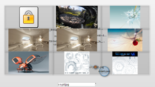

# mu
A visual file manager

# Screenshots

Drag and drop a folder, and explore.


Type a filtering regular expression


Use the lasso to select


Identify documents, images, text


View images in a gallery



# Windows

Download and run : https://github.com/smigniot/mu/releases/download/1.0/Mu_win64_1.0.zip

# Linux

Download and run : https://github.com/smigniot/mu/releases/download/1.0/Mu_linux64_1.0.tar.gz

# Usage

* Drag and drop a folder on the Mu screen
* Clic to shrink or expand a folder
* Use the search field at bottom to filter
* Selection with lasso to sum up files
* Simple clic to sum up all visible files
* Clic on green arcs to display image galleries


# Build from source

Download Electron :
```wget https://github.com/electron/electron/releases/download/v1.2.1/electron-v1.2.1-linux-x64.zip```

Download Mu :
```wget https://github.com/smigniot/mu/archive/master.zip```

Unzip all in $ELECTRON and $MU and run :
```$ELECTRON/electron $MU```


# On nginx

* Place the Mu files in a Mu folder under www,

* And some files under /Work. Mu.html contains a sample nginx.conf

